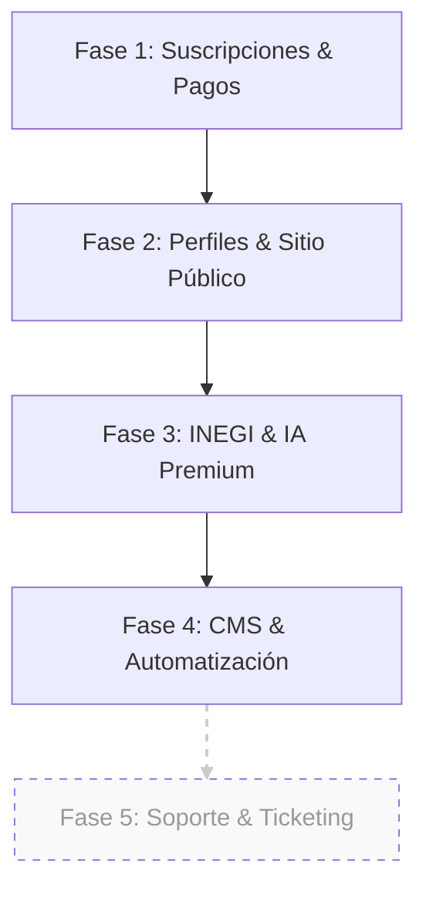

# 🗺️ Flujo de Trabajo — Garza Casas IA

Este documento define la estructura y el orden de implementación para las fases restantes del proyecto, priorizando la estabilidad del modelo de negocio (suscripciones) y las funciones premium diferenciadoras (INEGI/IA).

> [!IMPORTANT]
> **Estado del Módulo de Tickets:** Se ha suspendido el desarrollo activo del sistema de soporte para centrar esfuerzos en las funcionalidades críticas del core. Las tablas y lógica iniciales se mantienen como pendientes en el backlog.

---

## 🛰️ Roadmap de Implementación

---

## 📋 Detalle de las Fases

### 💳 Fase 1: Suscripciones y Pasarela (Prioridad Máxima)
*Objetivo: Permitir que los agentes paguen y el sistema restrinja funciones según el plan.*

- [ ] **DB Logic:** Ejecutar y validar `20260304_subscription_functions.sql` (Verificador de límites).
- [ ] **Mercado Pago Webhook:** Implementar `src/app/api/webhooks/mercadopago/route.ts` para capturar pagos exitosos.
- [ ] **Plan Enforcement:** Conectar el `PropertyForm` con `check_property_limit()` para bloquear la creación si el agente excedió su límite.
- [ ] **Dashboard de Suscripción:** Finalizar la UI en `/dashboard/subscription` para mostrar el plan actual y el historial de pagos.

### 👤 Fase 2: Agentes y Conectividad Pública
*Objetivo: Que los agentes tengan presencia real en el sitio y puedan ser contactados.*

- [ ] **Perfil de Agente:** Crear `/dashboard/profile` para que el agente suba su bio, foto y redes sociales.
- [ ] **Directorio Real:** Cambiar el componente de Agentes en el Home para leer de la tabla `profiles`.
- [ ] **SEO de Agente:** Página pública `/agente/[slug]` con sus propiedades activas y botón de WhatsApp directo.

### ⭐ Fase 3: Integración INEGI & IA (Diferenciador Premium)
*Objetivo: Implementar las funciones que justifican el Plan Platino.*

- [ ] **DENUE API:** Crear el API Route para consultar servicios cercanos (Caché de 7 días).
- [ ] **Badge de Plusvalía:** Cálculo automático basado en el histórico de precios de la zona.
- [ ] **Generador IA (Gemini):** Implementar la generación de descripciones persuasivas usando datos reales del INEGI.
- [ ] **Insights de Zona:** Panel de análisis avanzado para el agente (Platino).

### 🖋️ Fase 4: Blog y Automatización SEO
*Objetivo: Generar tráfico orgánico masivo mediante contenido especializado.*

- [ ] **Blog Engine:** Sistema de artículos dinámicos basados en municipios de México.
- [ ] **Automatización de Contenido:** Script que use IA para redactar reportes de mercado mensuales por zona.

### 🛠️ Fase 5: Soporte y Mantenimiento (Pendiente / Backlog)
*Objetivo: Gestión de incidencias internas.*

- [x] **DB Schema:** Migración inicial creada (`20260305_support_system.sql`).
- [ ] **Frontend:** Dashboard de tickets para agentes.
- [ ] **Admin View:** Panel para que el equipo de Garza Casas responda tickets.

---

## 🚦 Estado de Prioridades Actual

| Tarea | Impacto | Complejidad | Estado |
| :--- | :--- | :--- | :--- |
| **Logic de Suscripción (SQL)** | 🔴 Alto | 🟡 Medio | En Proceso |
| **Checkout Mercado Pago** | 🔴 Alto | 🟡 Medio | Pendiente |
| **Integración INEGI/DENUE** | 🟢 Alto | 🔴 Alto | Investigación OK |
| **CRM / Tickets de Soporte** | ⚪ Bajo | 🟡 Medio | **DETENIDO** |

---

## 🛠️ Próximos pasos inmediatos

1. **Migración:** Ejecutar las funciones de suscripción en el SQL Editor de Supabase.
2. **Webhook:** Crear el endpoint de notificaciones para Mercado Pago.
3. **Validación:** Probar el flujo completo de "Mejorar Plan" -> "Pago en MP" -> "Plan Actualizado en DB".

---
*Documento generado: 5 de marzo de 2026*
